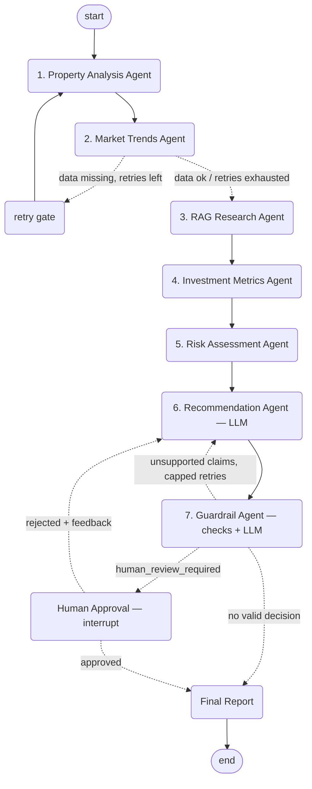

# Property AI - Indian Property Investment Advisor

A LangGraph-based property investment advisor for the Indian real estate market.
Given a property address, INR budget, horizon, and strategy, it produces a grounded
BUY / HOLD / AVOID recommendation, routes it through guardrails, and requires human
approval before generating reports.

Ships with:

- CLI: `main.py`
- FastAPI backend: `app.py`
- Static frontend: `frontend/index.html`

All entry points use the same LangGraph workflow.

## Architecture

The graph has seven agents over a shared `PropertyState`:



- Agents 1-5 are deterministic/tool-based: property lookup, market lookup, RAG,
  investment metrics, and risk scoring.
- The Recommendation Agent uses Groq for the judgment call and returns decision,
  justification, evidence, and confidence.
- The Guardrail Agent keeps checks concise: missing data, high risk, weak confidence,
  negative operating cash flow, conflicting RAG evidence, and unsupported claims.
- Human review is mandatory before a final report is produced.

## Data

No live scraping. The project uses curated mock data and a local RAG corpus:

- `src/property_advisor/data/mock_properties.json`
- `src/property_advisor/data/mock_market_trends.json`
- `src/property_advisor/data/mock_risk_data.json`
- `src/property_advisor/data/rag_corpus/*.txt`

The app runs offline except for Groq LLM calls. ChromaDB handles local vector retrieval;
no embedding API key is required.

## Installation

Requires Python 3.11+.

```bash
python3.11 -m venv .venv
.venv/bin/pip install -r requirements.txt
cp .env.example .env
```

Add your Groq key to `.env`:

```bash
GROQ_API_KEY=...
```

Optional:

```bash
GROQ_MODEL=llama-3.3-70b-versatile
LANGSMITH_TRACING=false
LANGSMITH_API_KEY=...
```

## Run the CLI

```bash
.venv/bin/python main.py --address "Whitefield, Bangalore" --budget 9500000 \
  --horizon 5 --strategy rental
```

Omit flags to be prompted interactively. At the human-review step, approve or reject
the recommendation. Approval generates JSON, Markdown, and PDF reports under
`reports/`.

Useful flags:

- `--auto-approve` skips the approval prompt.
- `--no-reports` skips report generation.
- `--reports-dir <path>` changes the report destination.
- `--demo` runs fixed demo scenarios.

For manual presentation steps, see [DEMO_WALKTHROUGH.md](DEMO_WALKTHROUGH.md).

## Run the API and Frontend

```bash
.venv/bin/python app.py
```

Open `http://localhost:8080/`.

The browser flow mirrors the graph: analyze a property, review the recommendation and
guardrail reasons, then approve or reject. Approval generates downloadable reports.

Main endpoints:

- `POST /analyze`
- `POST /approve`
- `POST /reject`
- `GET /reports/{filename}`

## Reports

Generated reports include the property summary, market data, financial metrics, risk
assessment, recommendation, guardrail reasons, human decision, and timestamp.

Output files:

```text
reports/<property_slug>.json
reports/<property_slug>.md
reports/<property_slug>.pdf
```

## Tests and Evals

Deterministic tests:

```bash
.venv/bin/python -m pytest tests/ -v
```

Evaluation scenarios, requiring `GROQ_API_KEY`:

```bash
.venv/bin/python evals/run_evals.py
```

The evals cover high-growth, weak-return, flood-risk, missing-data, and conflicting
evidence scenarios.

## Observability

Structured agent and router logs are written to `logs/project.log`.

LangSmith tracing is optional. Set `LANGSMITH_TRACING=true` and `LANGSMITH_API_KEY`
in `.env` to enable it.
